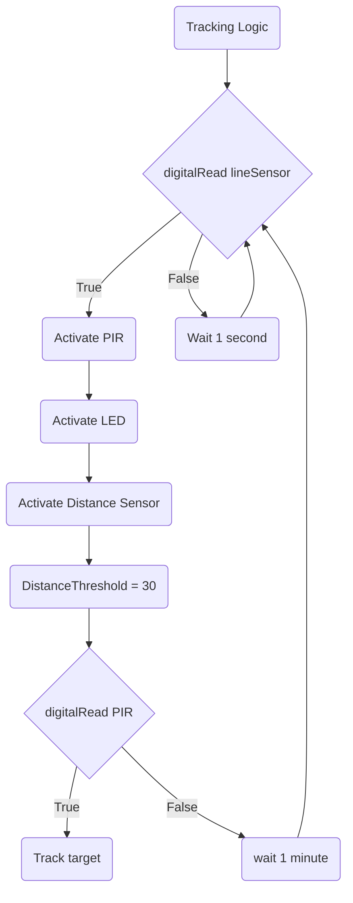
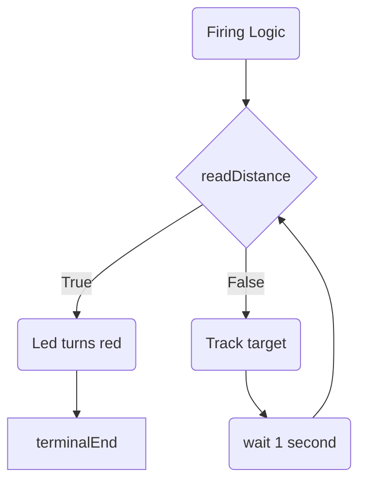

 Behaviour 1/Standby Logic: When the button on the remote is pressed the turret shall be activated the turret and the line sensor shall be activated. At this point you shall also be able to adjust the angle of the turret using a pontonmeiter. This is also located on the remote 

 ```mermaid
 flowchart TD
 %%standby logic
terminalStart1([Standby Logic])
 terminalEnd1([Activate line sensor])
 Button(Button)
Buttontrigger{digitalRead Button}
activateturret(Activate Turret)
activatesensor(Activate line sensor)
loop(Wait 1 second)
terminalStart1 --> Button
terminalStart1 --> Buttontrigger
Buttontrigger --> |True| activateturret
activateturret --> activatesensor
Buttontrigger --> |False| loop
loop -->Buttontrigger
```
Behaviour 2/Tracking Logic: If the line sensor has been triggered the PIR sensor, distance sensor and LED shall be activated. Also once the sensor has been triggered the turret shall begin to start to search for moving targets using the PIR sensor. If the PIR sensor detects a moving target then the turret shall phyisclly track the target. If not then it shall continue to search for the target for a further minute. If no targets are detected by then the turret shall stop searching for targets and return to the beginning of the tracking logic. 

Behavior 3/Firing: If the target has reached the distance threshold then the led shall turn red the buzzer shall be activated indicating that the turret is firing upon the target. If the target hasn't reached the distance threshold then the turret shall keep tracking the target until the target isn't dectected aka is no longer moving.
